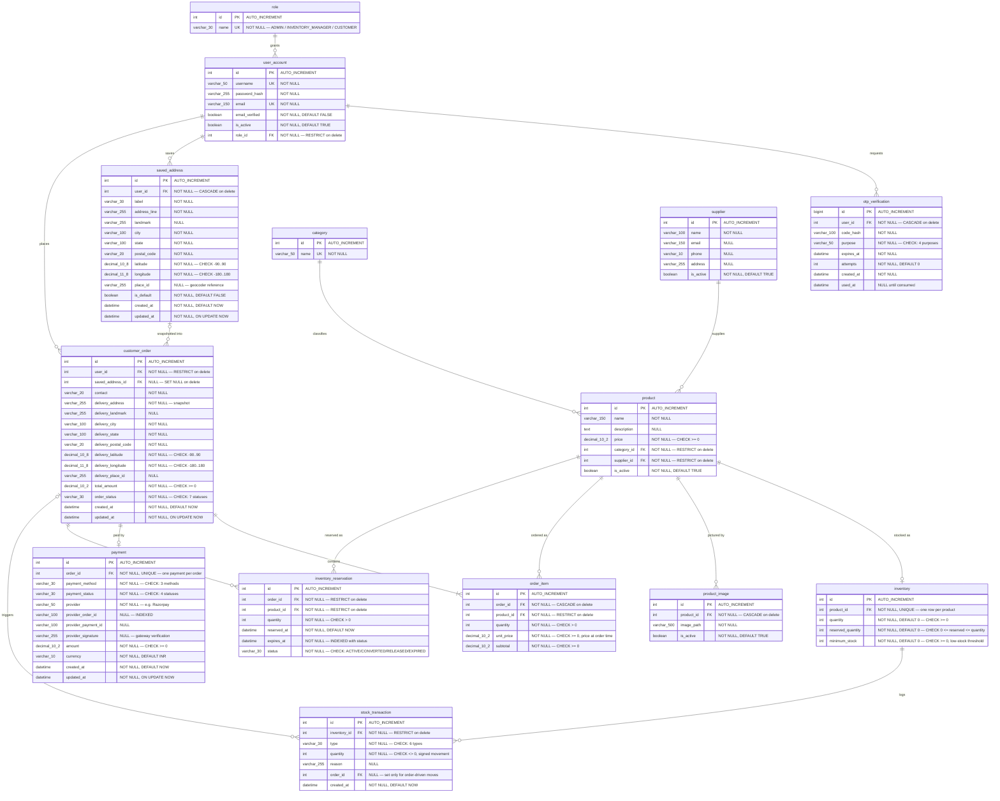
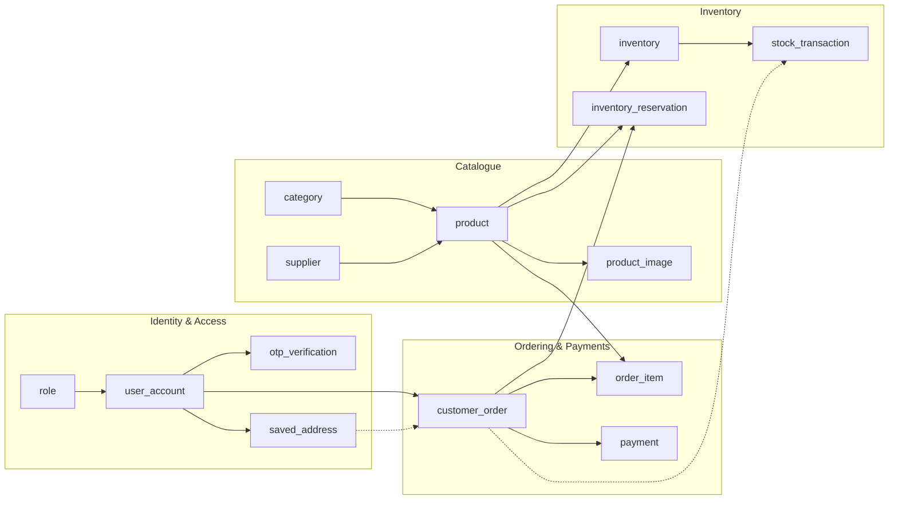

# Bakery Inventory Management System — ER Diagram

Entity–relationship model derived from [`db_bakery-inventory.sql`](./db_bakery-inventory.sql)
(MySQL, schema `bakery_inventory`). 14 tables covering authentication, catalogue,
inventory, ordering and payments.

---

## 1. Full ER Diagram

---

## 2. Relationships at a Glance

| # | Parent | Child | Cardinality | FK column | ON DELETE | Notes |
|---|--------|-------|-------------|-----------|-----------|-------|
| 1 | `role` | `user_account` | 1 : N | `role_id` | RESTRICT | Every user has exactly one role |
| 2 | `user_account` | `otp_verification` | 1 : N | `user_id` | CASCADE | OTPs die with the user |
| 3 | `user_account` | `saved_address` | 1 : N | `user_id` | CASCADE | Address book |
| 4 | `user_account` | `customer_order` | 1 : N | `user_id` | RESTRICT | Orders block user deletion |
| 5 | `saved_address` | `customer_order` | 0..1 : N | `saved_address_id` | SET NULL | Optional link; address is also copied into the order |
| 6 | `category` | `product` | 1 : N | `category_id` | RESTRICT | |
| 7 | `supplier` | `product` | 1 : N | `supplier_id` | RESTRICT | |
| 8 | `product` | `inventory` | 1 : 1 | `product_id` (UNIQUE) | RESTRICT | One stock row per product |
| 9 | `product` | `product_image` | 1 : N | `product_id` | CASCADE | Images die with the product |
| 10 | `customer_order` | `order_item` | 1 : N | `order_id` | CASCADE | Order lines |
| 11 | `product` | `order_item` | 1 : N | `product_id` | RESTRICT | |
| 12 | `customer_order` | `payment` | 1 : 1 | `order_id` (UNIQUE) | RESTRICT | `uk_payment_order` enforces one payment per order |
| 13 | `customer_order` | `inventory_reservation` | 1 : N | `order_id` | RESTRICT | `UNIQUE (order_id, product_id)` — one reservation per product per order |
| 14 | `product` | `inventory_reservation` | 1 : N | `product_id` | RESTRICT | |
| 15 | `inventory` | `stock_transaction` | 1 : N | `inventory_id` | RESTRICT | Full stock movement ledger |
| 16 | `customer_order` | `stock_transaction` | 0..1 : N | `order_id` | RESTRICT | Nullable — manual adjustments have no order |

`product` ↔ `customer_order` is effectively a many-to-many resolved by the
`order_item` junction table (which carries its own attributes: quantity,
unit price and subtotal).

All foreign keys use `ON UPDATE CASCADE`, except `fk_order_saved_address`
(`ON UPDATE RESTRICT`).

---

## 3. Enumerated Values (CHECK constraints)

| Table.column | Allowed values |
|---|---|
| `otp_verification.purpose` | `EMAIL_VERIFICATION`, `ACCOUNT_DELETION`, `PASSWORD_RESET`, `ADMIN_INVENTORY_MANAGER_DELETION` |
| `customer_order.order_status` | `PENDING_PAYMENT`, `PLACED`, `CONFIRMED`, `PROCESSING`, `READY`, `DELIVERED`, `CANCELLED` |
| `payment.payment_method` | `NETBANKING`, `CREDIT_CARD`, `DEBIT_CARD` |
| `payment.payment_status` | `PENDING`, `PAID`, `FAILED`, `REQUIRES_REFUND` |
| `inventory_reservation.status` | `ACTIVE`, `CONVERTED`, `RELEASED`, `EXPIRED` |
| `stock_transaction.type` | `PURCHASE`, `SALE`, `SUPPLIER_RETURN`, `DAMAGE`, `ADJUSTMENT`, `CANCEL` |
| `role.name` (seeded) | `ADMIN`, `INVENTORY_MANAGER`, `CUSTOMER` |

---

## 4. Functional Grouping

---

## 5. Design Notes

- **Address snapshotting.** `customer_order` copies the full delivery address
  (line, city, state, postal code, lat/long, place id) instead of relying on
  `saved_address_id` alone. Editing or deleting a saved address therefore never
  rewrites the delivery details of a historical order — the FK just goes `NULL`.
- **Price snapshotting.** `order_item.unit_price` and `subtotal` freeze the price
  at order time, so later changes to `product.price` don't restate past orders.
- **Two-phase stock.** `inventory.quantity` is physical stock and
  `reserved_quantity` is the soft-held portion, guarded by
  `CHECK (reserved_quantity <= quantity)`. `inventory_reservation` rows hold
  stock for a pending order until `expires_at`; the index
  `idx_reservation_status_expires (status, expires_at)` supports the sweeper
  that expires stale holds.
- **Auditability.** `stock_transaction` is an append-only ledger of every stock
  movement, with a signed `quantity` (`CHECK (quantity <> 0)`) and an optional
  `order_id` linking sales and cancellations back to their order.
- **Soft deletes.** `user_account`, `supplier`, `product` and `product_image`
  carry `is_active` flags; combined with `ON DELETE RESTRICT` on the
  transactional paths, historical records stay intact.

---

## 6. Supporting Indexes

| Index | Table | Columns |
|---|---|---|
| `idx_reservation_status_expires` | `inventory_reservation` | `(status, expires_at)` |
| `idx_payment_provider_order` | `payment` | `(provider_order_id)` |
| `idx_customer_order_user_status` | `customer_order` | `(user_id, order_status)` |
